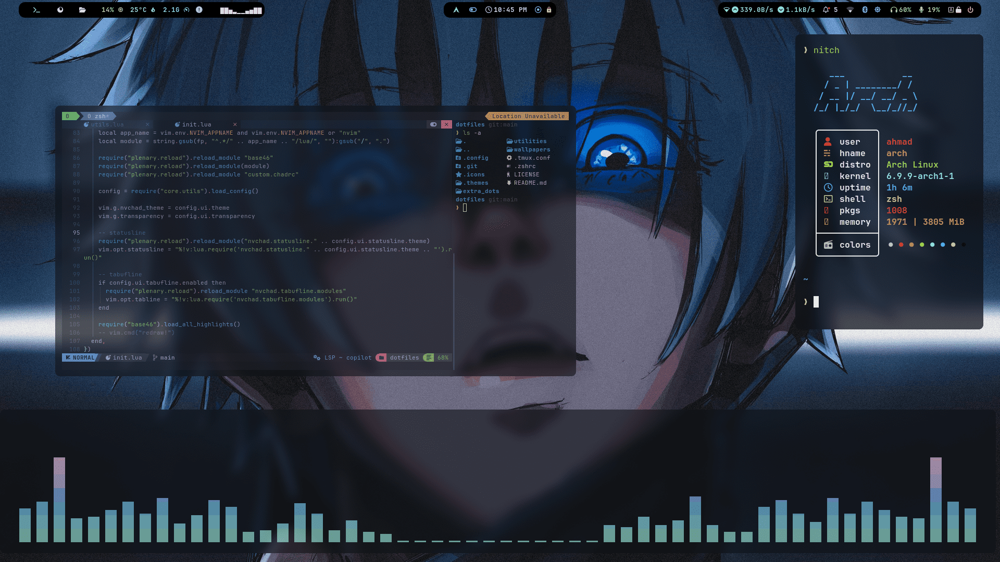
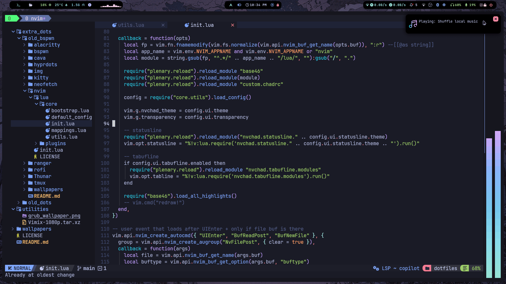
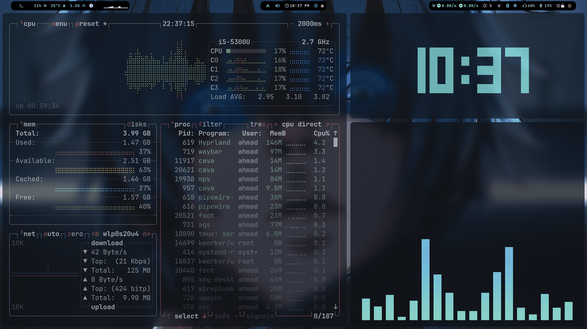
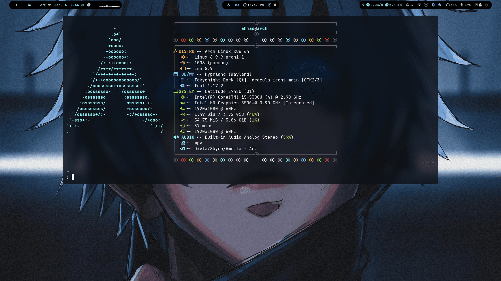
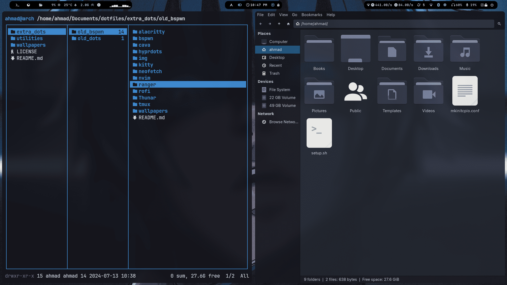
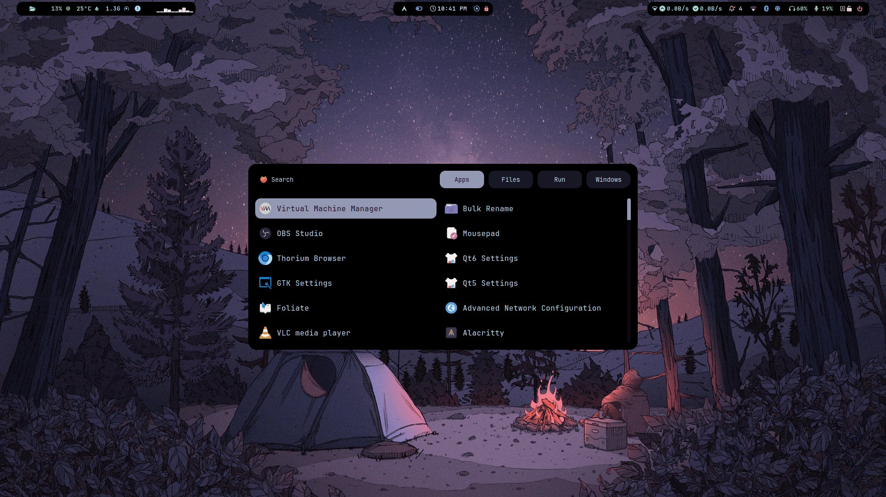
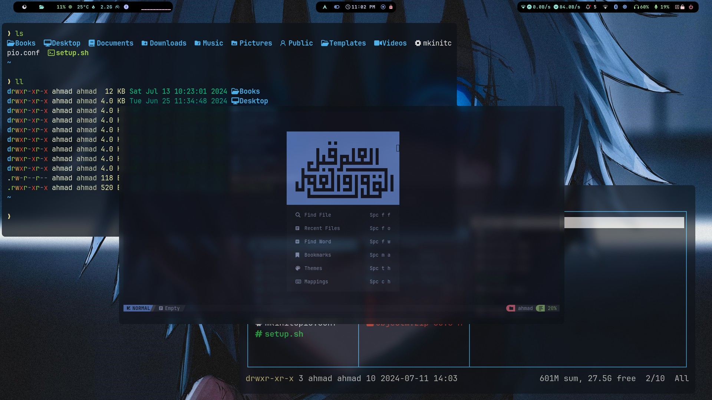

# Dotfiles

**Dotfiles** is a collection of configuration files aimed at setting up a personalized and efficient Linux environment. This repository includes configurations for various tools and applications, enhancing productivity and aesthetics.


## Review of Arch (btw)




|  |  |
|---|---|
|  |  |
|  |  |


## Table of Contents

1. [Features](#features)
2. [Installation](#installation)
3. [Usage](#usage)
4. [Contributions](#contributions)
5. [License](#license)
6. [Contact](#contact)

## Features

- **Application Configurations**: Custom settings for various applications.
- **Backup of Old Configurations**: Archive of previous configurations.
- **Wallpapers**: A curated collection of wallpapers.

## Installation

To set up your environment using these dotfiles, follow these steps:

1. **Clone the Repository**:
    ```bash
    git clone https://github.com/ahmad9059/dotfiles.git
    cd dotfiles
    ```

2. **Backup Existing Dotfiles**:
    Before copying new configurations, it's wise to back up your current dotfiles:
    ```bash
    mkdir -p ~/dotfiles_backup
    cp ~/.config ~/dotfiles_backup -r
    cp ~/.tmux.conf ~/dotfiles_backup
    cp ~/.zshrc ~/dotfiles_backup
    ```

3. **Copy New Configurations**:
    ```bash
    cp -r .config ~/
    cp .tmux.conf ~/
    cp .zshrc ~/
    cp -r .themes ~/.themes
    cd .icons
    unzip .icons.zip
    rm .icons.zip
    cp -r ./ ~/.icons
    ```

## Usage

After installation, you can start using the configured applications. Modify the configurations as per your preferences:

- **tmux**: Start tmux with custom settings using:
    ```bash
    tmux
    ```

- **zsh**: Ensure zsh is your default shell, then reload configurations:
    ```bash
    chsh -s $(which zsh)
    source ~/.zshrc
    ```


### utilities

- Useful scripts and utilities for system management.

### wallpapers

- Curated collection of wallpapers for personalization.

## Contributions

Contributions are welcome! If you have improvements or additional configurations, feel free to fork this repository, make your changes, and submit a pull request.

## License

This project is licensed under the MIT License. See the [LICENSE](LICENSE) file for details.

## Contact

For any questions, suggestions, or issues, please open an issue in this repository or contact the repository owner directly.

---

Enjoy your personalized Linux setup!
