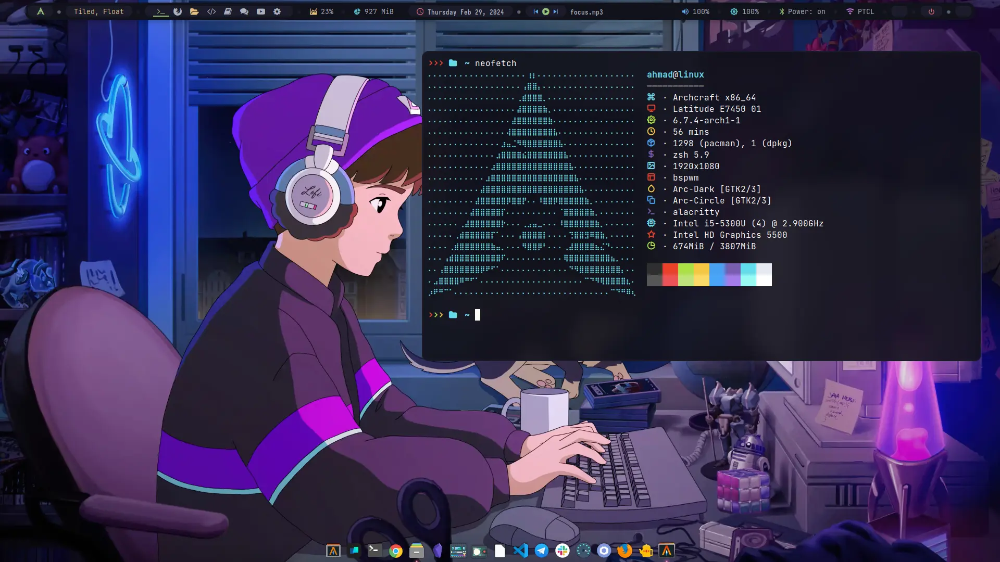
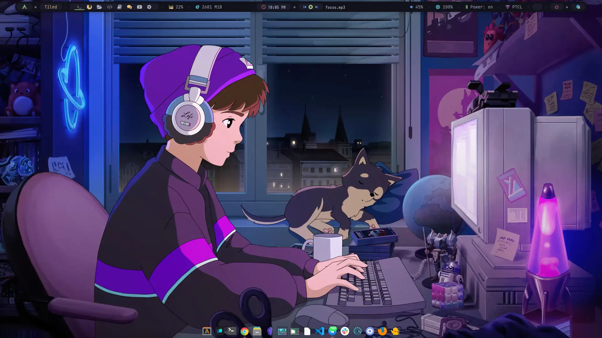
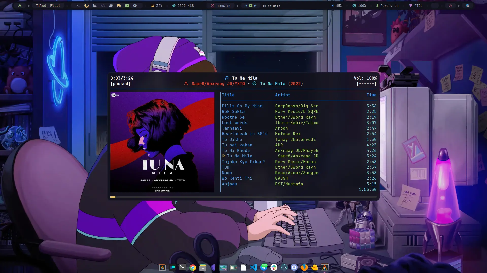
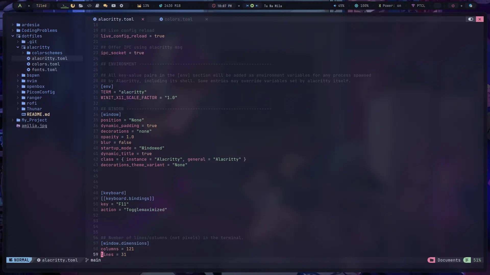
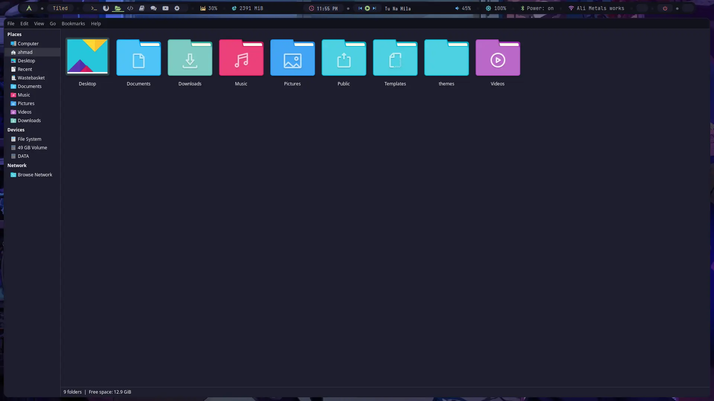

# Arch Linux Configurations

This repository contains my personal configuration files for various components of my Arch Linux setup, offering insights into customization options and workflow enhancements.

## Preview
<div style="display: flex;">
    
    
    
    
    
    
</div>

## Included Configurations

### 1. PicomConfig
- **Description:** Configuration for Picom, a highly customizable compositor for X11.
- **Features:** Offers transparency effects, window fading, and shadow enhancements.

### 2. Alacritty
- **Description:** Configuration for Alacritty, a GPU-accelerated terminal emulator.
- **Features:** Provides a fast and minimalistic terminal experience with customizable settings.

### 3. Bspwn
- **Description:** Configuration for Bspwn, a tiling window manager known for its efficiency.
- **Features:** Offers dynamic window management and easy customization of keybindings.

### 4. Neovim
- **Description:** Configuration for Neovim, a powerful text editor designed for developers.
- **Features:** Extensive plugin support, built-in terminal emulator, and efficient editing capabilities.

### 5. Openbox/dark_one
- **Description:** Configuration for Openbox, a lightweight and highly configurable window manager.
- **Features:** Customized theme (dark_one) providing a sleek and visually appealing desktop environment.

### 6. Thunar
- **Description:** Configuration for Thunar, a modern file manager for Xfce.
- **Features:** Offers a user-friendly interface with support for advanced file management tasks.

### 7. Ranger
- **Description:** Configuration for Ranger, a console-based file manager with Vim-like keybindings.
- **Features:** Enables efficient file navigation and manipulation directly from the terminal.

### 8. Rofi
- **Description:** Configuration for Rofi, a versatile application launcher and window switcher.
- **Features:** Provides quick access to applications and windows, with customizable appearance and behavior.


## Usage

1. **Clone this repository:**

   ```bash
   git clone https://github.com/ahmad9059/dotfiles.git
